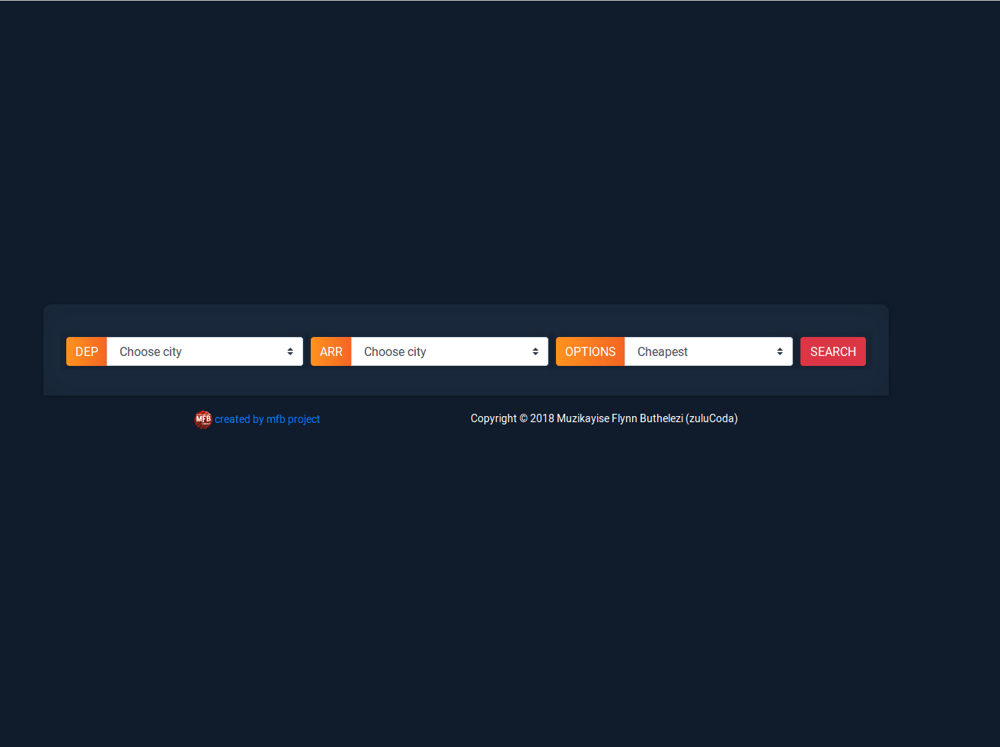

Travel Agency
======================

This is my solution to the Property Finder Front-end challenge.

[](https://travel-agency.mfbproject.co.za/)

## Demo
Live demo [https://travel-agency.mfbproject.co.za/](https://travel-agency.mfbproject.co.za/)

## Installation
To install dependencies, navigate to the project root directory your console and execute the following command:
```shell
npm install
```

## Test
To run tests
```shell
npm test
```

## Run
To run solution
```shell
npm start
```

## Solution / Tech Stack
The project was created using `create-react-app`. This project conforms to the [Air BnB style guide's](https://github.com/airbnb/javascript) naming and coding-style conventions. Furthermore, I use the [Redux ducks modular pattern](https://github.com/erikras/ducks-modular-redux) for reducers, containers, and actions.

Other:
* I use `redux` for state management. My personal opinion: Always use `redux` for state management. [Check out my blog article on this](https://blog.mfbproject.co.za/2018/03/11/so-you-want-to-know-what-you-should-test-when-using-react/)
* I use `sass` to manage `css`, `bootstrap` and have created the layout using `flexbox`.
* For my development workflow, I also use `Generate React Code` which is my own tool which I co-created with a colleague. We created this tool so that team members will easily conform to our agreed conversion. Additionally, the tool promotes "test first" principles.
* `Prettier` - Automatically formats code after every commit.
* `Enzyme` for `view` (React Component) tests.

## Project Structure
```
travel-agency
└───src
    └───components
    └───constants
    └───redux
    └───service
    |   index.js
    |   registerServiceWorker.js.js
    |   setupTests.js
```

